# Income & Expense Tracker

Aplikasi pencatatan keuangan (income & expense tracker) berbasis web yang dibangun menggunakan **Laravel 13**. Aplikasi ini tidak hanya mencatat transaksi sederhana, tetapi sudah dikembangkan menjadi sistem pembukuan personal yang komprehensif — mencakup manajemen multi-akun (dompet), kategori transaksi, transfer antar akun, budgeting bulanan, target tabungan (saving goals), transaksi berulang, hingga panel admin untuk mengelola pengguna dan data master sistem.

## Identitas Pengembang

| | |
|---|---|
| **Nama** | Gilang Akbar Hadikosyah |
| **NIM** | 240170133 |

## Tech Stack

- **Backend:** Laravel 13.8, PHP 8.3
- **Frontend:** Blade, Tailwind CSS, Alpine.js, Chart.js
- **Database:** MySQL
- **Autentikasi:** Laravel Breeze
- **PDF Export:** barryvdh/laravel-dompdf
- **REST API:** Laravel Sanctum

## Akun Demo

Gunakan kredensial berikut untuk menguji aplikasi:

| Role | Email | Password |
|---|---|---|
| **Admin** | `admin@mail.com` | `admin123` |
| **User** | `user@mail.com` | `user12345` |

> **Catatan Verifikasi Email:** Aplikasi ini menggunakan [Mailtrap](https://mailtrap.io) *sandbox* sebagai SMTP server untuk keperluan pengujian proses verifikasi email saat registrasi, sehingga email tidak benar-benar terkirim ke inbox asli melainkan bisa dilihat langsung di dashboard Mailtrap. Kredensial sandbox ini sudah disertakan di `.env.example` khusus untuk kebutuhan demo/pengujian tugas. Jika aplikasi ini nantinya ingin di-deploy sebagai aplikasi nyata (production), kredensial `MAIL_*` wajib diganti dengan layanan email asli (misalnya Gmail SMTP, Mailgun, SES, atau provider lain) agar email verifikasi benar-benar terkirim ke pengguna.

## Fitur Utama

### 1. Manajemen Transaksi & Multi-Akun
- CRUD transaksi (income/expense) dengan kategori dinamis dan lampiran struk (upload gambar).
- Sistem multi-akun/dompet (Tunai, Bank, E-Wallet, dst.) dengan saldo yang dihitung otomatis dari riwayat transaksi.
- Transfer antar akun yang tercatat sebagai sepasang transaksi (keluar-masuk) sehingga Net Worth total tidak berubah.

### 2. Perencanaan Finansial
- **Budgeting bulanan** per kategori, lengkap dengan progress bar dan peringatan saat mendekati/melampaui limit.
- **Saving Goals (Target Tabungan)** — alokasikan dana dari akun manapun ke target tertentu, lengkap dengan fitur **penarikan dana (withdraw)** bila target dibatalkan, serta progress pencapaian yang dihitung real-time dari riwayat transaksi (bukan angka statis).
- **Transaksi Berulang** (recurring) untuk tagihan rutin bulanan, diproses otomatis lewat Laravel Task Scheduling.

### 3. Dashboard & Analitik
- Ringkasan Net Worth, filter periode (bulan/tahun), dan grafik interaktif (mingguan/bulanan/tahunan) menggunakan Chart.js + Alpine.js tanpa reload halaman.
- **Export laporan ke PDF** sesuai periode yang sedang difilter.

### 4. Admin Panel
- Manajemen pengguna: ubah role (User ↔ Admin), reset password, serta suspend/ban akun bermasalah.
- Manajemen data master (kategori & jenis akun default) tanpa hardcode di kode program.
- Statistik pertumbuhan sistem (total user, total transaksi, tren registrasi bulanan).
- Broadcast pengumuman yang tampil sebagai banner ke seluruh pengguna.

### 5. REST API
Aplikasi ini pada dasarnya dibangun dengan arsitektur **monolitik** (Blade + server-side rendering), bukan aplikasi API-first. Karena itu, hanya **beberapa endpoint utama** yang sengaja diekspos sebagai REST API (diautentikasi via Laravel Sanctum) — tujuannya murni untuk keperluan pengujian/demonstrasi kemampuan integrasi API, bukan sebagai backend utama aplikasi:

| Method | Endpoint | Keterangan |
|---|---|---|
| GET | `/api/transactions` | Daftar transaksi |
| POST | `/api/transactions` | Buat transaksi baru |
| DELETE | `/api/transactions/{id}` | Hapus transaksi |
| GET | `/api/accounts` | Daftar akun |
| POST | `/api/accounts` | Buat akun baru |
| GET | `/api/saving-goals` | Daftar target tabungan |
| POST | `/api/saving-goals` | Buat target tabungan baru |

## Instalasi

Ikuti langkah berikut untuk menjalankan aplikasi ini di lokal setelah clone dari GitHub. Beberapa file (seperti `vendor/`, `node_modules/`, `.env`, dan `database/*.sqlite*`) sengaja tidak ikut ter-push ke repository sesuai `.gitignore`, sehingga langkah-langkah berikut wajib dijalankan agar aplikasi bisa berjalan.

```bash
# 1. Clone repository
git clone https://github.com/<username>/<nama-repo>.git
cd <nama-repo>

# 2. Install dependency PHP
composer install

# 3. Install dependency JavaScript
npm install

# 4. Salin file environment
cp .env.example .env
```

### Setup Database MySQL

Aplikasi ini menggunakan **MySQL**. Pastikan MySQL Server sudah terinstall dan berjalan di komputer Anda (lewat XAMPP, Laragon, atau instalasi MySQL langsung), lalu buat database kosong:

```bash
# Masuk ke MySQL CLI
mysql -u root -p

# Setelah masuk, buat database kosong dengan nama sesuai DB_DATABASE di .env
CREATE DATABASE income_expense_tracker;
exit
```

Atau jika Anda menggunakan phpMyAdmin, cukup buat database baru bernama `income_expense_tracker` (atau nama lain, asalkan disesuaikan juga dengan nilai `DB_DATABASE` di `.env`) lewat antarmuka phpMyAdmin.

Buka file `.env` yang baru saja disalin, lalu sesuaikan bagian berikut dengan kredensial MySQL lokal Anda:
```env
DB_CONNECTION=mysql
DB_HOST=127.0.0.1
DB_PORT=3306
DB_DATABASE=income_expense_tracker
DB_USERNAME=root
DB_PASSWORD=
```

```bash
# 5. Generate application key
php artisan key:generate

# 6. Jalankan migration untuk membuat seluruh tabel di database MySQL
php artisan migrate

# 7. Jalankan seeder (data master kategori/jenis akun default + akun demo Admin & User)
php artisan db:seed

# 8. Buat symbolic link storage (dibutuhkan untuk upload struk transaksi)
php artisan storage:link

# 9. Build asset frontend
npm run build

# 10. Jalankan server lokal
php artisan serve
```

Aplikasi dapat diakses di `http://localhost:8000`.

> **Catatan email verification:** Middleware `verified` aktif pada aplikasi ini, artinya pengguna baru (hasil register mandiri) wajib memverifikasi email sebelum bisa mengakses dashboard. Karena `DemoUserSeeder` di atas sudah menandai `email_verified_at`, kedua akun demo bisa langsung login tanpa proses ini. Untuk mengaktifkan pengujian alur registrasi & verifikasi email yang sesungguhnya, isi kredensial `MAIL_*` di `.env` dengan akun [Mailtrap](https://mailtrap.io) (lihat dokumentasi screenshot di bawah).

### Menjalankan Scheduler (Transaksi Berulang)

Fitur transaksi berulang diproses lewat Laravel Scheduler. Untuk development lokal, jalankan manual saat ingin menguji:
```bash
php artisan transactions:process-recurring
```
Untuk produksi, daftarkan cron job berikut di server:
```
* * * * * cd /path-to-project && php artisan schedule:run >> /dev/null 2>&1
```

## Dokumentasi Tampilan Aplikasi

### 1. Halaman Awal & Autentikasi
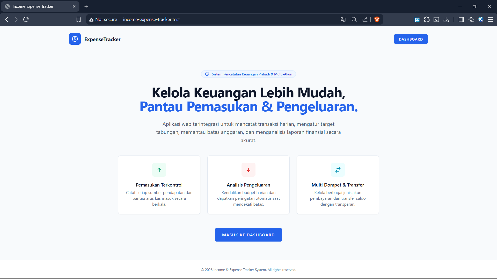
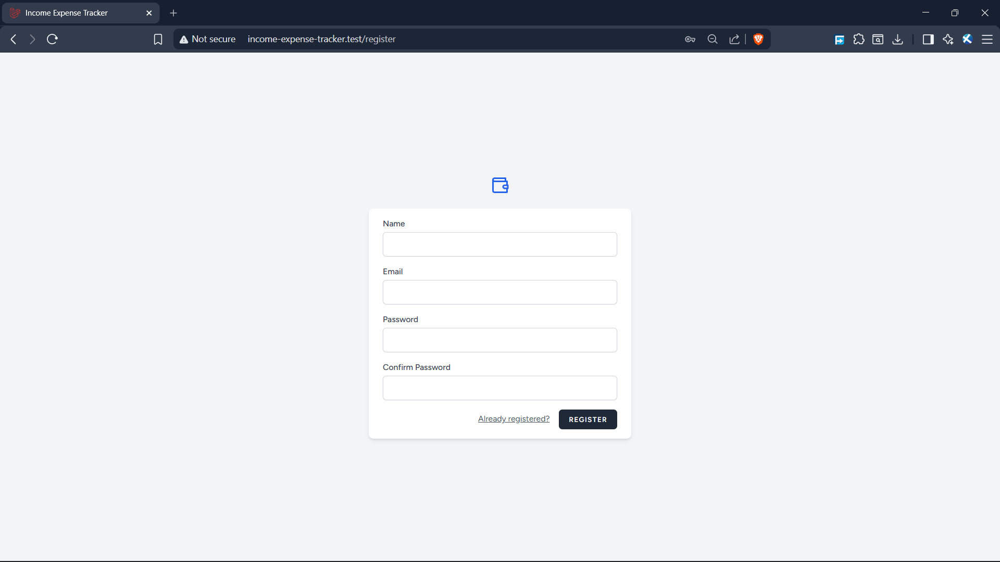
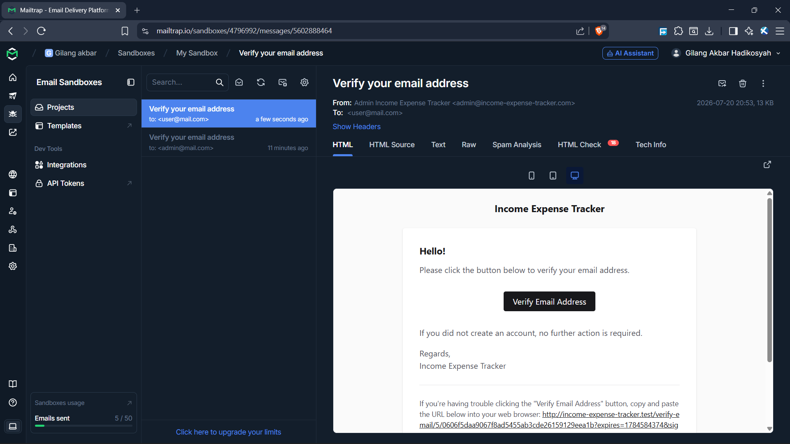

### 2. Dashboard Utama & Grafik Finansial
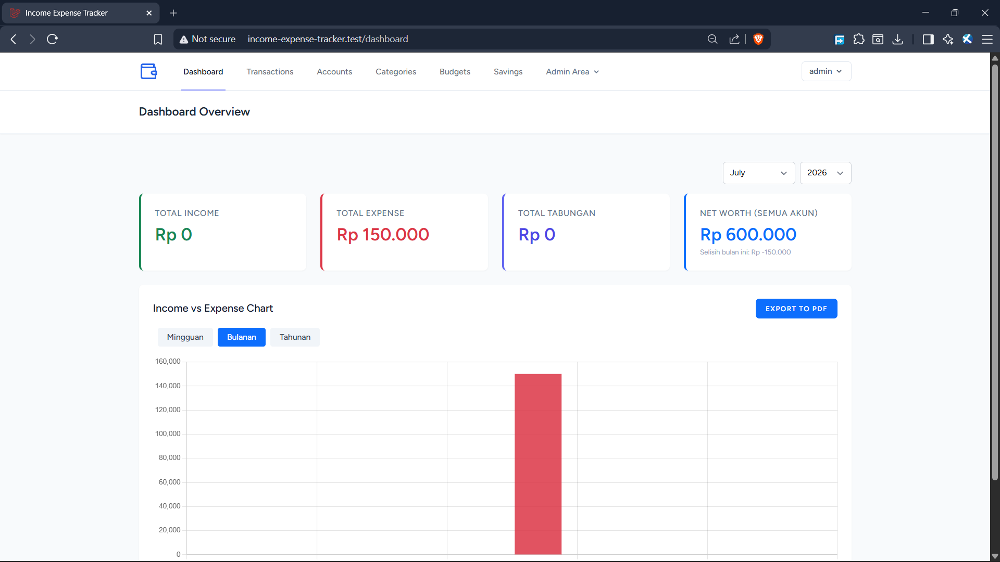

### 3. Manajemen Akun & Kategori
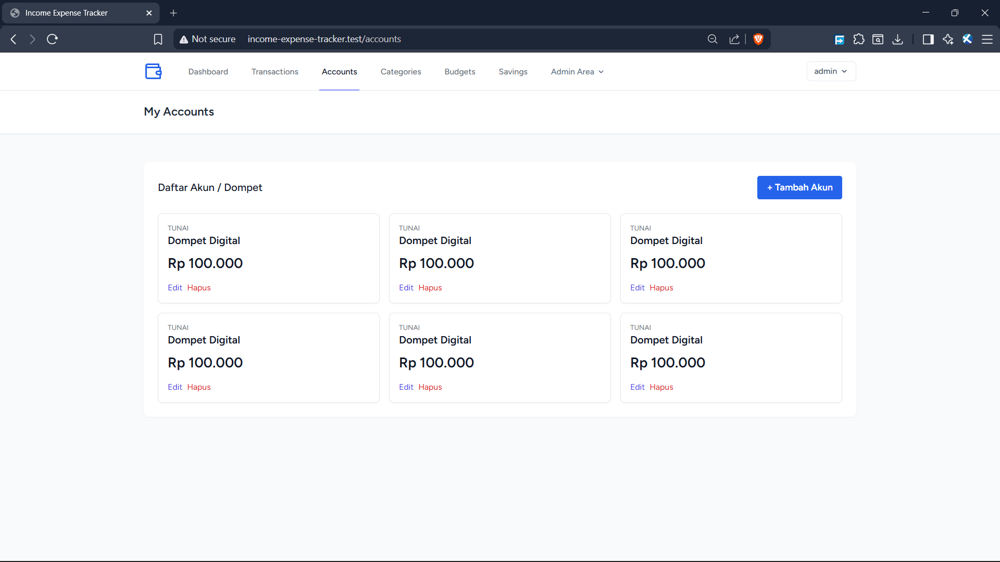
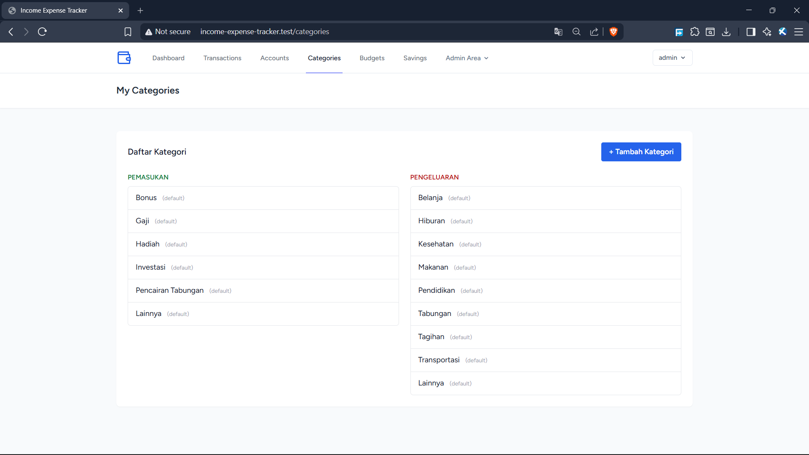

### 4. Transaksi, Budget & Target Tabungan
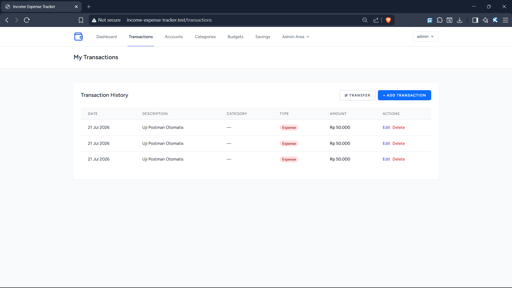
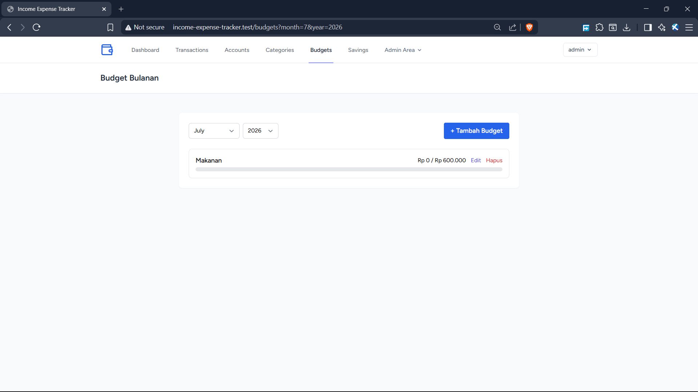
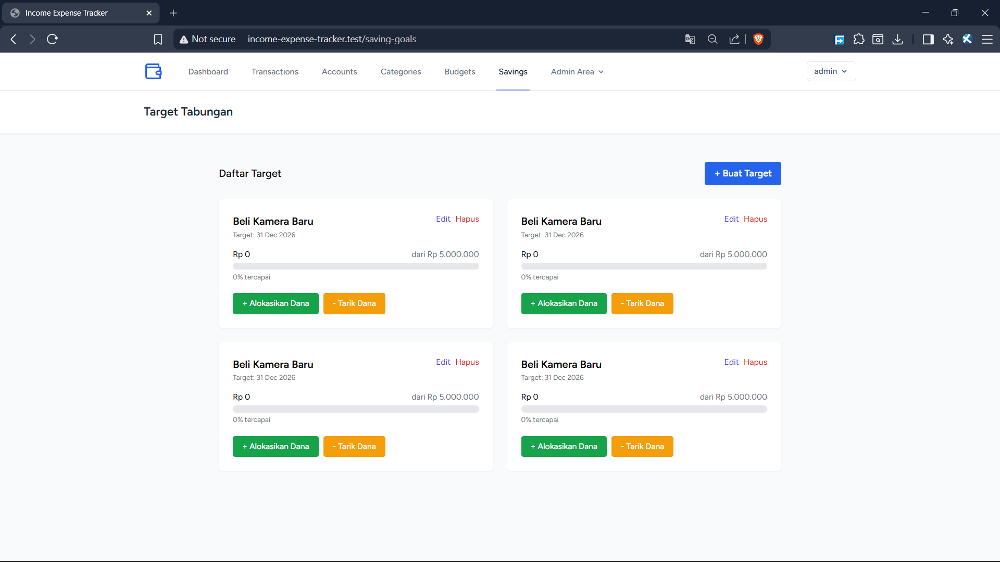

### 5. Panel Admin
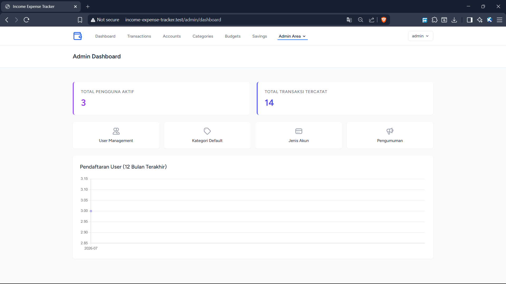
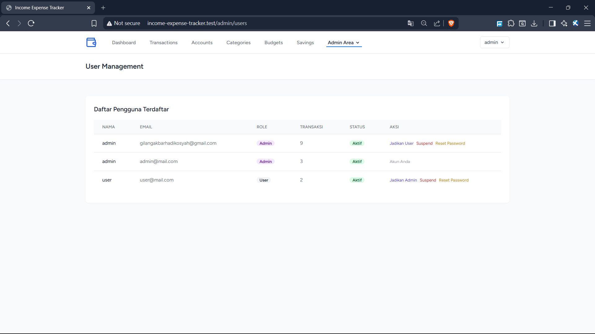

### 6. Tampilan Responsif (Mobile)
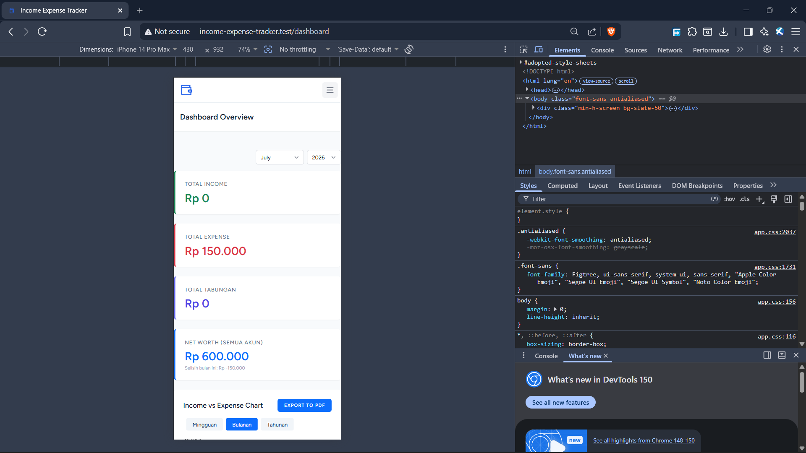

### 7. Hasil Export PDF
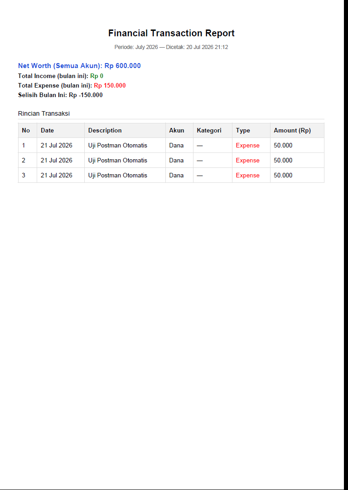

### 8. Pengujian REST API di Postman
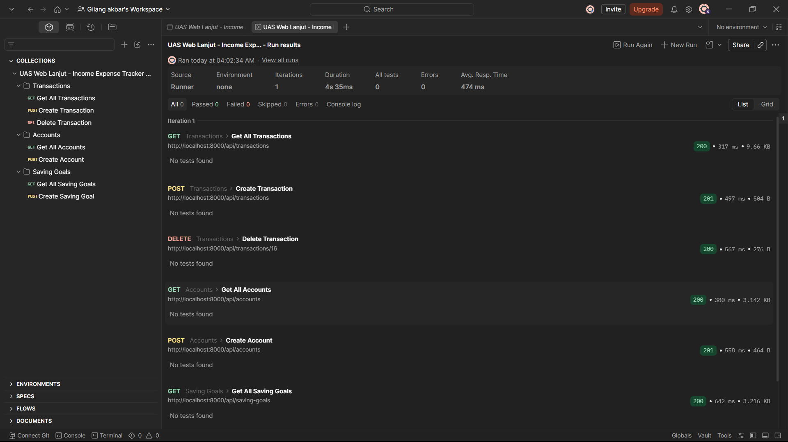

## Laporan Pendukung

Anda dapat mengunduh sampel laporan PDF hasil export aplikasi melalui tautan berikut:
- [Unduh Laporan Keuangan PDF](docs/Laporan-Keuangan-7-2026.pdf)

## Struktur Basis Data Singkat

Ringkasan tabel utama pada aplikasi ini:

- `users` — data pengguna, termasuk `role` (admin/user) dan `is_banned`.
- `accounts` & `account_types` — dompet/akun milik user beserta jenisnya.
- `categories` — kategori transaksi (default global maupun custom per user).
- `transactions` — ledger utama; menyimpan seluruh income, expense, transfer (via `transfer_group_id`), dan alokasi tabungan (via `saving_goal_id`).
- `budgets` — batas anggaran bulanan per kategori.
- `saving_goals` — target tabungan; progress dihitung agregasi real-time dari `transactions`, bukan kolom statis.
- `recurring_transactions` — template transaksi berulang yang diproses scheduler.
- `announcements` — pengumuman broadcast dari Admin ke seluruh user.

## Lisensi

Proyek ini dibuat untuk keperluan Tugas Akhir (UAS) mata kuliah Pemrograman Web lanjut (A7)
